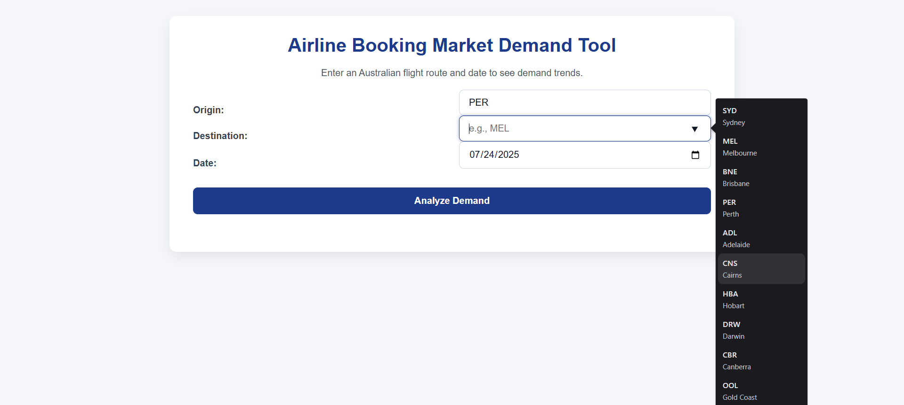
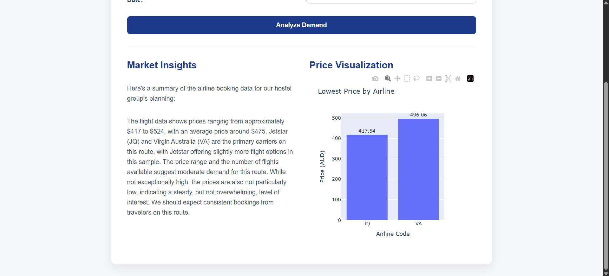

# Airline Market Demand Tool

The Airline Market Demand Tool is a web application designed to help the Australian hospitality industry analyze airline booking trends. It provides actionable insights by fetching live flight data, using an AI for market analysis, and presenting price comparisons in a user-friendly, visual dashboard.


## Live Demo / Screenshot

Screenshots of the application in action:





## Key Features

*   **Live Flight Data:** Integrates with the **Amadeus for Developers API** to fetch real-time flight offers, including pricing and carrier information for specified routes.
*   **AI-Powered Insights:** Leverages the **Google Gemini API** to process the raw flight data and generate a concise, human-readable summary of market demand, pricing trends, and carrier popularity.
*   **Interactive Visualizations:** Uses **Plotly** to create interactive bar charts that visualize the lowest price offered by each airline on a given route, making price comparisons easy.
*   **User-Friendly Interface:** A clean and responsive web interface built with **Flask** and modern CSS. It features autocomplete suggestions for major Australian airports to enhance usability and reduce input errors.
*   **Data Processing:** Utilizes the **Pandas** library to efficiently clean and aggregate the data fetched from the API before it is passed to the AI and visualization components.

## Technology Stack

*   **Backend:** Python, Flask
*   **Frontend:** HTML5, CSS3
*   **Data Source:** Amadeus for Developers API
*   **AI Analysis:** Google Gemini API
*   **Data Handling:** Pandas
*   **Visualization:** Plotly
*   **Environment Management:** `python-dotenv` for handling secret API keys.

---

## Setup and Installation

To run this project locally, please follow these steps:

**1. Clone the Repository**
```bash
git clone https://github.com/Hemanth0411/flight-data-analysis.git
cd flight-data-analysis
```

**2. Create and Activate a Virtual Environment**
It is highly recommended to use a virtual environment to manage project dependencies.

*   **On macOS/Linux:**
    ```bash
    python3 -m venv venv
    source venv/bin/activate
    ```
*   **On Windows:**
    ```bash
    python -m venv venv
    .\venv\Scripts\activate
    ```

**3. Install Dependencies**
Install all the required Python libraries using the `requirements.txt` file.
```bash
pip install -r requirements.txt
```


**4. Configure Environment Variables**
This project requires API keys to function. You must create a `.env` file in the root directory of the project according to the format given in `.env.example`.

Replace the placeholder text with your actual keys from Amadeus and Google AI Studio.

---

## How to Run the Application

Once the setup is complete, you can run the Flask application with a single command:

**1. Start the Flask Server**
```bash
flask run
```

**2. Access the Application**
Open your web browser and navigate to the following address:
```
http://127.0.0.1:5000
```

You should now see the application running and be able to analyze airline market demand